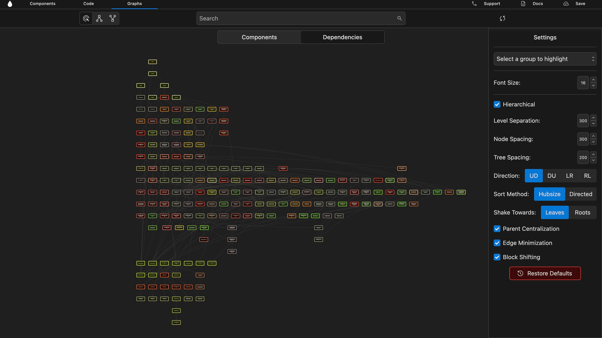
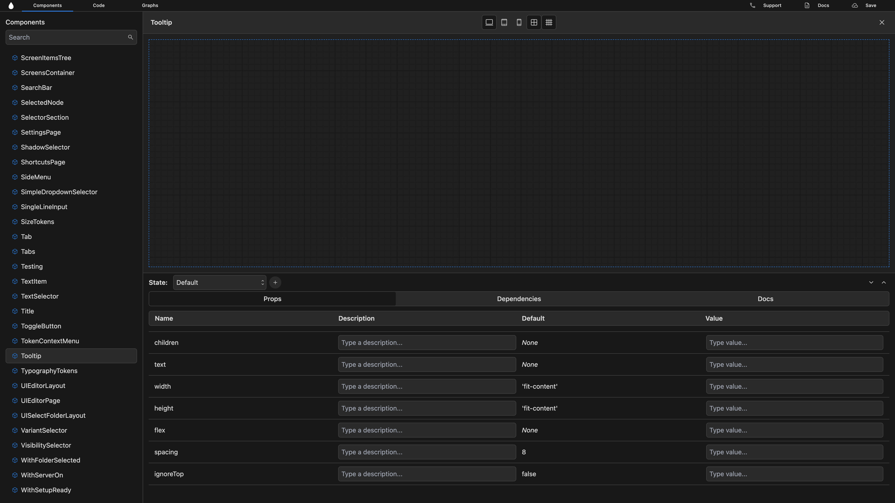
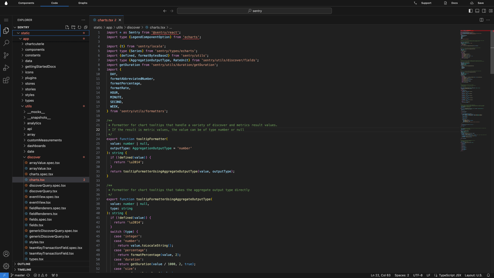
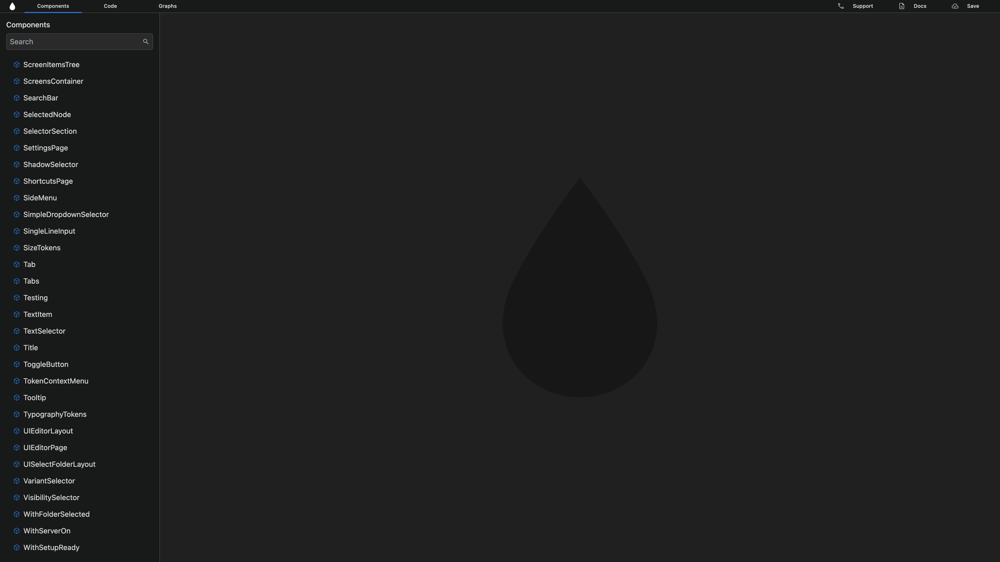

# Introduction

**Welcome to Agua!** understand a new codebase in under 5 minutes.

***

## What is Agua?

Agua is a **React Visual Environment**. With Agua, you can understand codebases faster and document easily every change you make. As developers ourselves, we hate working with large codebases and poor documentation. We want you to spend less time figuring out where the code is and understanding how it works so you can have more time to build amazing things.&#x20;

> **Agua is free for developers!**



<figure><figcaption></figcaption></figure>



## What can you do in Agua?

If you are new to a project, Agua will generate a component and dependencies graph so you can visualize all your code structure. For each task, Agua will help you locate each file and preview each component with its props. You can edit each component directly in our integrated IDE and use AI to document all your work. As you push your changes, your team will have access to your documentation.

> **Understand and document code faster!**

## Key Features:

### 1. Components Tree

> Visualize component hierarchies and locate their files: ‍**Find where your code is.**



<figure><figcaption></figcaption></figure>



### 2. Dependencies Tree

> Visualize component dependencies: **Review all code relationships.**



<figure><figcaption></figcaption></figure>



### 3. Component Preview

> Visualize each component and its props: **Understand how code works.**



<figure><figcaption></figcaption></figure>



### 4. Integrated IDE

> Edit code in our web-based VS Code: **Avoid context-switching.**



<figure><figcaption></figcaption></figure>



### 5.  Documentation

Generate documentation with AI: **Document with one-click**



<figure><figcaption></figcaption></figure>



## Get Started!
