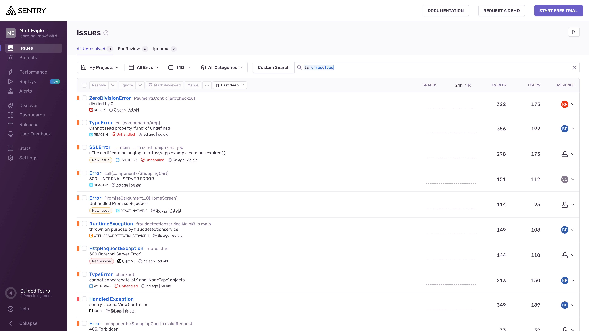
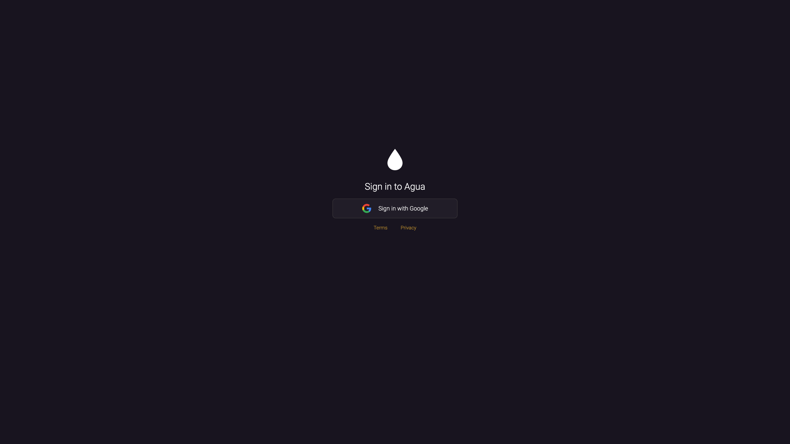
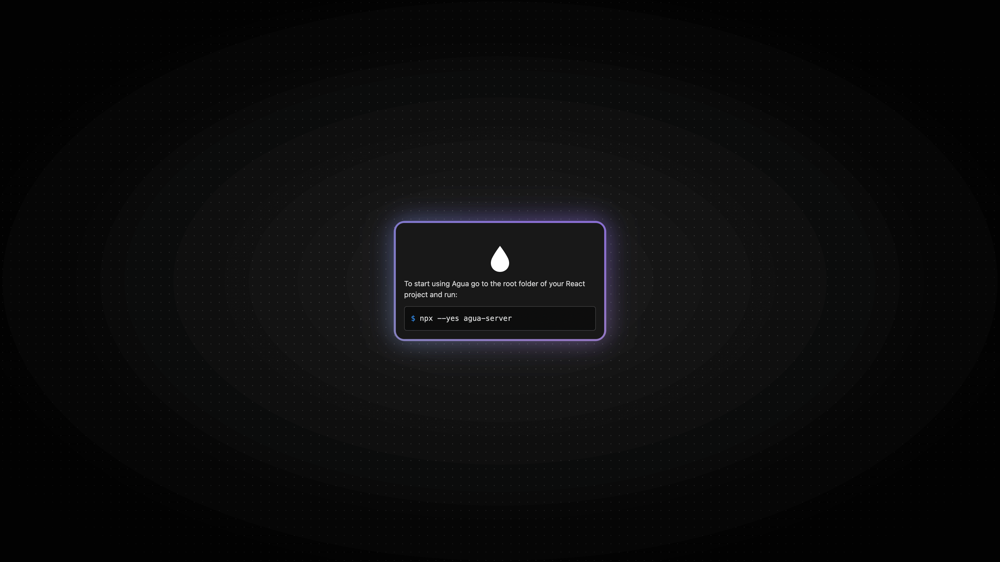
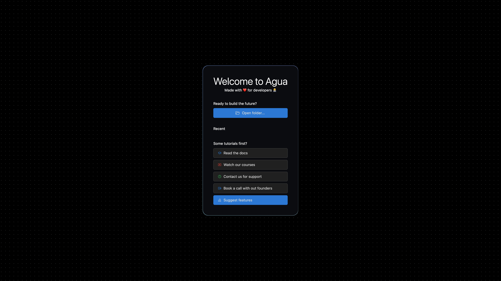
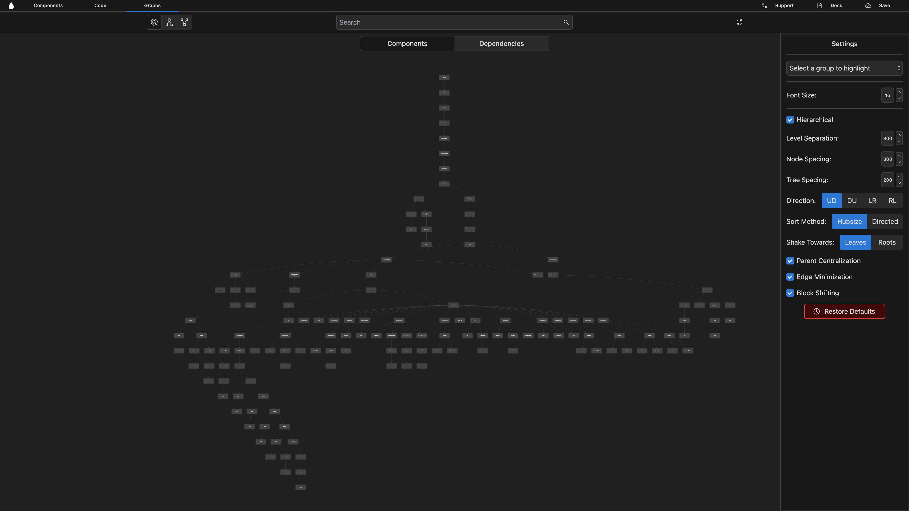

# Sentry: Tutorial

In this tutorial, we'll walk through [Sentry's](https://sentry.io/) codebase's components and dependency structure.

***




<figure><figcaption></figcaption></figure>




## Basic Setup

Retrieve all necessary assets from [Sentry's GitHub](https://github.com/getsentry) and start using Agua.

***


### 1. Codebase setup[​](https://docs.agua.dev/installation#1-codebase-setup) <a href="#id-1-codebase-setup" id="id-1-codebase-setup"></a>

> Fork and clone the GitHub repository locally:

```
https://github.com/getsentry/sentry.git
```


### 2. Agua setup[​](https://docs.agua.dev/installation#2-agua-setup) <a href="#id-2-agua-setup" id="id-2-agua-setup"></a>


#### 2.1 Sign Up

> Open Agua's [web editor](https://auth.agua.app/signin/):

```
https://auth.agua.app/signin/
```

> Register with your [Google Account](https://www.google.com/account/about/).&#x20;



<figure><figcaption></figcaption></figure>




Agua is currently only supported in [**Google Chrome**](https://www.google.com/intl/es-419/chrome/).



#### 2.2. Terminal installation[​](https://docs.agua.dev/installation#21-terminal-installation) <a href="#id-21-terminal-installation" id="id-21-terminal-installation"></a>

> Go to the root folder of the Sentry repository and run:

```
npx --yes agua-server
```



<figure><figcaption></figcaption></figure>




Agua is currently only supported in [**Node.js 18**](https://nodejs.org/en/download).



#### 2.3 Welcome menu[​](https://docs.agua.dev/installation#22-welcome-menu) <a href="#id-22-welcome-menu" id="id-22-welcome-menu"></a>




<figure><figcaption></figcaption></figure>



> You can also access:
>
> * Our Documentation \[[_Read the docs_](https://docs.agua.dev/)]
> * Out Tutorials \[[_Watch our courses_](https://www.youtube.com/@aguafordevs)]
> * Our WhatsApp contact \[[_Contact us for support_](https://wa.me/12396883277)]
> * Our one-to-one onboarding \[[_Book a call with our founders_](https://agua.tools/meetings/developers/onboarding)]


### 2.3 Folder Selection[​](https://docs.agua.dev/installation#23-folder-selection) <a href="#id-23-folder-selection" id="id-23-folder-selection"></a>




<figure><figcaption></figcaption></figure>




### 2.4 Agua Settings[​](https://docs.agua.dev/installation#24-agua-settings) <a href="#id-24-agua-settings" id="id-24-agua-settings"></a>


## Platform Tour[​](https://docs.agua.dev/installation#3-platform-tour) <a href="#id-3-platform-tour" id="id-3-platform-tour"></a>

***


### 3.1 **Components** Graph <a href="#id-33-graphs" id="id-33-graphs"></a>

### 3.1. Component Preview[​](https://docs.agua.dev/installation#31-component-previews) <a href="#id-31-component-previews" id="id-31-component-previews"></a>

### 3.3 **Dependencies** Graph <a href="#id-33-graphs" id="id-33-graphs"></a>

### 3.4 Code editor[​](https://docs.agua.dev/installation#32-code-editor) <a href="#id-32-code-editor" id="id-32-code-editor"></a>

